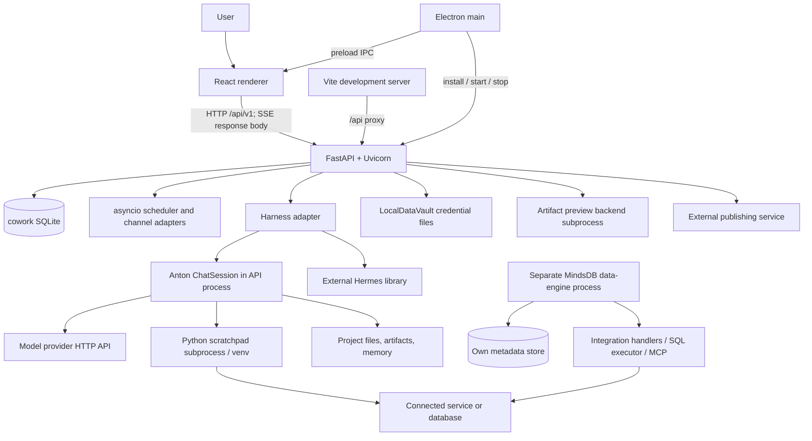

# MindsHub architecture at the recovered revision

Investigation date: 2026-09-15. Scope: source recovery and implementation-led architectural review; no product code, dependency versions, or security behavior changed.

**Evidence labels:** **CONFIRMED** means directly observed in this checkout; **INFERRED** means a consequence of the cited implementation that was not exercised; **UNKNOWN** means not verified. Unless explicitly qualified, implementation descriptions below are CONFIRMED by the adjacent source references. This is a map of significant execution paths, not a claim that every utility or integration has been exhaustively audited.

## Recovery and verification record

The initial directory was a valid, clean superproject checkout on `main`, with four empty, uninitialized submodules. Origin: `https://github.com/mindsdb/mindshub.git`. No evidence required reconstructing a partial file copy. Git could not read the user's global ignore file under the sandbox; that warning did not prevent checkout/status inspection.

| Repository | Recovered commit |
| --- | --- |
| Superproject | `780bbcbb8b9367c667e9b6af2aecc8277f24c0ad` |
| frontend (`mindsdb/cowork`) | `4114336ee0cf1a8a04c20a96f4a92f30fe059c66` |
| backend/core_api (`mindsdb/cowork-server`) | `cb075bdf79242d865f5e8809cedfa1debb63e519` |
| backend/core_agent (`mindsdb/anton`) | `6b83930e510a984aa822a2cc46a2143a4e94343f` |
| backend/data-vault (`mindsdb/data-vault`) | `37ccd07febc9c4a20bd5c1fcd4f677efac553dc9` |

Recovery used `git submodule sync --recursive` followed by `git submodule update --init --recursive`, with approved access to protected Git metadata and network. All four now contain source and match the superproject pins; recursive status reported no additional nested submodules. Each submodule's working tree was clean after recovery. Three untracked architecture/lifecycle PDFs appeared during investigation and were preserved.

`.gitmodules` sets `ignore = all`: ordinary parent status can conceal changed submodules. Verify using `git status --ignore-submodules=none`, `git submodule status --recursive`, and status inside each module. Detached submodule HEADs are expected for pinned recovery.

**UNKNOWN: runtime correctness.** No dependencies were installed, app launched, provider contacted, integration credentials tested, or containers started. `uv` and `make` were absent from this shell's PATH; its `python` resolves to Python 3.14, outside Core API's `>=3.12,<3.14` requirement. Source completeness is verified separately from dependency and deployment reproducibility. Static checks and document validation are recorded at the end.

Git metadata remains intact. A later independent export would omit the root `.git/` (including `.git/modules/`), root `.gitmodules`, and each submodule's `.git` pointer file; it would preserve source, licenses, manifests, and lockfiles. Such an export loses history, remotes, pin tracking, and normal submodule recovery. Build scripts and dependencies can still refer to upstream Git after metadata removal. An export is safer than deleting metadata in this working checkout; neither was performed.

## 1. Project purpose

MindsHub is a desktop and browser workspace where a user organizes conversations into projects and asks an AI agent to work with files, connected systems, and generated artifacts. It combines a UI, an application API, interchangeable agent harnesses, model-provider clients, and local execution. It can generate more than chat text: Python execution can produce documents, datasets, dashboards, or applications. See `frontend/src/renderer/cowork/App.jsx`, `cowork/handlers/responses.py`, and `anton/core/session.py` (backend paths expanded below).

## 2. System overview

1. The root repository coordinates four independently versioned source repositories through Git commit pointers. The Makefile and Docker files compose some of them. A folder existing in the superproject does not imply its source has been downloaded. `.gitmodules` and the recovered Git tree are authoritative; some README/CLAUDE descriptions use older repository names and paths.

2. The frontend is React 19 with TypeScript/JavaScript, Vite, and Electron. It has separate browser and desktop entrypoints, but both eventually render the same cowork workspace. `frontend/src/renderer/main.tsx` requires the Electron preload bridge; `web-main.tsx` handles browser authentication before rendering `App.tsx`.

3. `App.tsx` controls onboarding gates: loading, introduction, terms, installation, coworker/theme selection, provider onboarding, and launch. `CoworkApp.tsx` bridges into `cowork/App.jsx`, which owns tasks, projects, artifacts, connectors, settings, and active navigation through React state. UI state and selected preferences also use browser localStorage.

4. `cowork/api.js` is the principal application API client. Its actual base is `/api/v1`, despite older comments saying `/v1`. Browser requests use the current origin; packaged Electron requests use loopback port 26866. Vite proxies `/api` to that backend. The platform adapter `platform/host.ts` separates browser capabilities from Electron IPC.

5. Core API is FastAPI, exposed through `cowork.server:app`. `cowork.cli.main` launches Uvicorn with configured host and port. Startup applies Alembic migrations, seeds the General project, migrates old settings, starts an asyncio scheduler, and loads configured channel adapters. It is an application server, not merely a proxy to an agent service.

6. Application state is primarily SQLModel/SQLAlchemy over SQLite at `~/.cowork/cowork.db`. Projects, messages, ordered message events, settings, files, skills, schedules, pins, and channels have model definitions. A database session is injected into handlers; actual uploaded bytes, generated artifacts, memory, and connector secrets live outside those rows.

7. Sending a message reaches `ResponsesHandler.handle`. It resolves or creates a conversation, records the user message, translates attachments, loads saved skills, and selects a harness from saved settings. The current handler explicitly ignores the request's model for execution. The chosen harness determines how the conversation reaches an agent.

8. Anton is embedded as a Python library in the API process. `AntonHarness._build_chat_session` constructs a workspace, model clients, memory context, connection context, and `ChatSessionConfig`, then `ChatSession.turn_stream` produces structured events. A separate always-running Anton HTTP service is not necessary for this path.

9. Anton's planner receives tools and a constructed system prompt. It calls a provider, executes returned tools, appends tool results to history, and calls the model again. It handles context pressure, repeated tool errors, retries, and optional completion verification. Python scratchpads run in persistent subprocesses with virtual environments, rather than inside the renderer.

10. Harness choice and provider choice are different axes. `cowork/harnesses/base.py` registers Anton and Hermes implementations. `cowork/services/providers.py` builds planning/coding providers for Anton. Hermes is an external Python dependency with a local adapter; its full implementation is not one of the four recovered submodules.

11. The cowork connection UI uses JSON connector specifications, a credential-submission endpoint, and an Anton-powered probe. Saved connections go to Anton's `LocalDataVault` under the configured cowork vault directory. Prompt context lists environment variable names, while execution receives the values. This path does not establish that credentials are inaccessible to agent-generated code.

12. The separate `backend/data-vault` repository is a much larger MindsDB data engine. It implements SQL execution, database/API handlers, metadata storage, knowledge bases, jobs, HTTP/MySQL APIs, and MCP. It has its own runtime configuration and Docker stack. The root Compose file does not launch it, and the traced cowork connector path uses local credentials and direct SDK/network access instead.

13. Artifacts are filesystem directories with metadata and generated files. Anton tools allocate them; scratchpad code writes content; API services discover and serve previews; React renders them. Fullstack artifacts can launch another Python backend. Publishing uploads to an external service and records local publication metadata.

14. Authentication is deployment-dependent. Browser localhost initialization uses Keycloak; non-loopback browser hosts skip that wrapper on the assumption of an external authenticated gateway. Desktop login uses main-process OAuth/token handling. The inspected FastAPI chat route has no user-auth dependency, so the external gateway assumption is a material deployment boundary, not authentication supplied by this API.

15. Several root launch recipes have drifted from the recovered components. Most notably, direct Uvicorn recipes omit the application's port setting, Docker health/proxy paths do not match API routes, and installing Core API does not automatically import the adjacent Core Agent checkout. These are recorded as findings, not silently repaired.

## 3. Repository map

```text
mindshub/
  frontend/                    React/Electron application submodule
    src/main/                  Electron lifecycle, installer, OAuth, IPC
    src/renderer/              Desktop/web entrypoints and cowork UI
    src/shared/                Shared IPC/types
    scripts/                   Development/release helpers
    server/                    Residual preview proxy and server tests; not the active API entry
  backend/
    core_api/cowork/           FastAPI endpoints, services, models, harness adapters
    core_api/tests/            API and migration tests
    core_agent/anton/          CLI plus reusable agent runtime
      core/                   Sessions, providers, tools, memory, execution, dispatch
    core_agent/tests/          Unit and stub-provider end-to-end tests
    data-vault/mindsdb/        Independent data engine
      api/                    HTTP, MySQL, MCP, SQL executor
      interfaces/             Database/knowledge-base/storage/job controllers
      integrations/           Handlers, libraries, query utilities
    data-vault/tests/          Handler/executor/integration tests
  docker/                     Root API/web images and nginx configuration
  docs/                       Public documentation site sources
  assets/                     Branding and contribution assets
  .github/                    CI, contribution templates, docs publishing
  .devcontainer/              Containerized development configuration
  Makefile                    Dependency, launch, packaging, ref-management recipes
```

## 4. Component architecture

| Component | Responsibility and boundary | Evidence |
| --- | --- | --- |
| Renderer | Onboarding, chat/activity, projects, artifacts, settings, data-source forms | `frontend/src/renderer/App.tsx`, `cowork/App.jsx`, `cowork/api.js` |
| Electron main/preload | OS integration, server install/lifecycle, OAuth, updates | `frontend/src/main/index.ts`, `preload.ts`, `installer.ts`, `server-process.ts` |
| Core API | Request validation, persistent product state, harness selection, file/preview services | `backend/core_api/cowork/server.py`, `api/v1/router.py`, `handlers/responses.py` |
| Anton | Prompt/model/tool loop and execution/memory support | `backend/core_agent/anton/core/session.py` |
| Hermes adapter | Translates API conversations/settings/tools into external Hermes execution | `backend/core_api/cowork/harnesses/hermes_harness/harness.py` |
| Local credential vault | Connection records and DS_* environment mappings | `backend/core_agent/anton/core/datasources/data_vault.py` |
| Separate data engine | Federated SQL, integration handlers, storage, MCP and jobs | `backend/data-vault/mindsdb/__main__.py`, `api/http/namespaces/sql.py` |
| External services | LLM inference, identity, publishing, connected systems | Provider/auth/publisher URLs in the respective client implementations; server implementations are outside this checkout |

## 5. Runtime architecture



There is deliberately no mandatory API-to-data-engine edge: it was not established for the traced chat path. The engine can be deployed separately. Anton also has remote scratchpad and dispatch abstractions, but their existence does not make them active in this local harness.

| Runtime mode | Processes/ports/storage |
| --- | --- |
| Desktop | Electron main + renderer, API normally loopback `26866`, on-demand scratchpad and artifact processes; user home state |
| Browser development | Vite `5173`, separately launched API `26866`; Keycloak on localhost; same filesystem/database state |
| Root Docker | API host port `26866`, nginx host port `3000`, `cowork-data` volume mounted at `/home/cowork/.cowork`; no vault service |
| Data-engine Compose | MindsDB ports `47334`/`47335`, Postgres/pgvector and observability services in its own Compose file; distinct deployment |

No Redis or distributed job broker is required by the traced Core API path. Its streams, caches, preview tokens, and scheduler task are process-local. **INFERRED:** deploying multiple API workers without coordination can duplicate schedules and fragment in-flight state. The separate data engine contains configurable queue infrastructure; do not equate it with Core API's scheduler.

## 6. Request lifecycle

### Chat and attachment flow

1. `frontend/src/renderer/cowork/App.jsx`: `handleSendFromHome` or `handleSendInTask` captures the prompt and task state. Attachments can be uploaded before the first message using a client-allocated conversation UUID.
2. `cowork/api.js`: `streamNewSession`/`streamMessage` call `_streamResponse`, which POSTs `/api/v1/responses` with input, conversation/project context, attachment IDs, disabled connections, and `stream: true`; an AbortController manages the browser request.
3. `backend/core_api/cowork/api/v1/endpoints/responses.py`: `responses` obtains a database session and invokes `ResponsesHandler.handle`.
4. `handlers/responses.py`: resolve project, preserve valid preallocated UUIDs, relink legacy attachment IDs where necessary, load previous messages, persist the new user message, and call the selected harness. `FileService.get_file_content` supplies disk paths; images are base64 blocks, other files become path instructions.
5. `harnesses/anton_harness/harness.py`: `_build_chat_session` loads DB-authoritative provider settings, workspace, memory, filtered connection context, prior messages, and scratchpad cells reconstructed from saved events.
6. `anton/core/session.py`: `turn_stream` executes the model/tool lifecycle described below.
7. `cowork/harnesses/anton_harness/stream_formatter.py`: `format_responses_stream` translates Anton events into Responses-style SSE. `ResponsesHandler._stream` injects the canonical conversation ID and harness into `response.created`.
8. The frontend parses the streamed body, feeds events into `cowork/lib/responseStreamAdapter.js` (`reduceStream`), and updates text/progress/tool/artifact state. The same reducer hydrates persisted events later.
9. When the generator finishes normally, `ConversationService.save_assistant_turn` writes assistant text and ordered `MessageEvent` rows. It skips saving when text is empty; message and event commits are separate. **INFERRED:** abrupt cancellation/failure can leave incomplete persistence because `_stream` saves after iteration, not in a finalizer.

`/responses/tail` explicitly returns status JSON; full SSE event replay is unimplemented. History comes from `/conversations/{id}/items`. `/responses/cancel` sets a process-local event checked by the stream wrapper; do not assume it immediately interrupts every running subprocess.

### Authentication flow

Browser: `web-main.tsx` → hostname classification → localhost `ReactKeycloakProvider` using `login-required` and S256 PKCE → `saveMindsToken` → `host.saveSettings` plus `syncSettingsToDb` → application onboarding. Refresh updates stored credentials. Non-loopback hosts render directly under an assumed gateway cookie. **UNKNOWN:** the gateway's implementation, tenant isolation, and policy are outside the recovered app code.

Desktop: `preload.ts` exposes named IPC methods → `index.ts` login handlers → `minds-auth.ts` identity/organization/token operations, using `oauth-service.ts` for OAuth machinery → `token-store.ts`. Access tokens are in memory; refresh tokens are encrypted using Electron `safeStorage` into `mindshub-refresh.bin` when encryption is available. Desktop comments and implementation distinguish identity JWTs from a longer-lived inference key; do not treat all credentials as one session token.

The Core API chat request has a database dependency but no authentication dependency. `server.py` configures wildcard CORS. Local provider configuration does not add backend user authentication.

## 7. Agent lifecycle

`AntonHarness.stream_response` constructs a `ChatSession` for each request and iterates `turn_stream`; conversation continuity is rebuilt from database messages/events. This differs from Anton's dispatch runtime, which can cache sessions.

`ChatSessionConfig` carries the LLM client, settings, workspace, Cortex memory, system-prompt context, initial history, session ID, vault, extra tools, and replay cells. `ChatSystemPromptBuilder.build` combines runtime instructions, project `anton.md`, time, tool-specific prompts, datasource variable names, skills, memory, and the API harness suffix. Prompt rules about file access are instructions, not an OS boundary.

Execution sequence in `anton/core/session.py`:

1. Append user input; establish tracing and explainability context.
2. `_build_system_prompt` and `_build_tools` construct model input.
3. `plan_stream_with_recovery` calls `LLMClient.plan_stream`; provider events yield text, tool calls, completion, and usage.
4. `_stream_and_handle_tools` appends assistant tool-use blocks. Scratchpad execution uses `prepare_scratchpad_exec`, a named runtime from `ScratchpadManager`, and `execute_streaming`; other tools dispatch through `ToolRegistry.dispatch_tool`.
5. Tool output is converted into result blocks, scrubbed for known credentials on the model-history path, appended to history, and sent into another planning call. Failures become tool error text; repeated errors trigger resilience controls.
6. Context-pressure recovery summarizes history and compacts scratchpad output; history repair seals unmatched tool-use/result pairs. Output truncation can trigger a continuation.
7. Completion verification may assess COMPLETE/INCOMPLETE/STUCK and request more work or a diagnosis. `CoreSettings` defaults: 25 tool rounds, 3 continuations, context-pressure threshold 0.7, 5 consecutive errors, resilience nudge at 2. These are configurable, not infinite autonomy.
8. `turn_stream` permits two automatic recovery retries for unexpected errors; `TokenLimitExceeded` propagates without retry. Memory consolidation and observer flushes can run as background tasks.

Planning and coding are distinct model roles. Scratchpad boot code exposes structured LLM helpers to generated Python. The scratchpad uses a persistent namespace, captures output, supports package installation and timeouts, and executes compiled Python via `exec` in `core/backends/scratchpad_boot.py`. A venv isolates dependencies; it does not confine filesystem or network permissions.

Memory uses `Cortex`, `Hippocampus`, skills, consolidators, and ACC/cerebellum observers. The cowork Anton adapter currently comments out its episodic/history-store wiring and relies on API history; standalone CLI capabilities should not be described as automatically enabled for every cowork request. `core/runtime.py` and `chat_session.py` provide other runtime construction paths.

Hermes differs: its adapter constructs external `run_agent.AIAgent`, invokes `run_conversation`, and bridges callback events into an asyncio queue using `loop.call_soon_threadsafe`. It synchronizes configuration under `~/.cowork/hermes` and supplies provider credentials/base URLs. The adapter can be traced here; the dependency's internal planning loop is UNKNOWN until that dependency is installed and inspected.

## 8. Database/state architecture

| State | Technology/location | Writers → readers; lifetime and security |
| --- | --- | --- |
| Product records | SQLModel/SQLAlchemy, default `~/.cowork/cowork.db` | API services → API/harness; persistent until deletion; includes conversations and user data |
| Schema | `cowork/db/alembic/versions/`, `db/migrations.py` | Startup migrator → all DB clients; shared desktop/dev DB requires matching migrations |
| Settings secrets | Fernet ciphertext in `settings.value`; key `~/.cowork/.master_key` | `SettingService` → provider/harness settings; key + DB grants decryption; key file requests mode 0600 |
| Uploaded files | Configured `FileSettings.root_dir`, default under `.cowork`; DB File metadata | `FileService` → attachment reader; persistent bytes outside SQL |
| Projects | Configured root `~/.cowork/projects` or registered project path | `ProjectService`, user, scratchpad → harness/UI/file APIs |
| Artifacts | Normally `<project>/.anton/artifacts/<slug>/` | ArtifactStore and generated code → API/renderer/publisher; metadata.json, README.md, payload files |
| Local connection credentials | Cowork default `~/.cowork/data-vault`; CLI default `~/.anton/data_vault` | Probe/OAuth → LocalDataVault → env injection/execution; plaintext JSON with requested directory/file modes 0700/0600 |
| Probe submissions | `SubmissionStore` in-memory dictionary, 24-hour TTL | Submission endpoint → ProbeHandler; raw values, process lifetime/TTL |
| Probe credential file | Temporary `.env` file from CredentialProbe | Probe service → generated test code; cleanup/lifetime must be considered alongside abnormal termination |
| Connector OAuth state | Default `~/.cowork/oauth_state.json` | OAuthStateStore → Google callback; pending state/verifier/redirect and status timestamps are filesystem JSON |
| Agent memory | Global configured memory root and project `.anton/memory`; rules/lessons/topics Markdown | Cortex/Hippocampus/API memory services → prompt builder; may contain sensitive user information |
| Standalone agent history | JSON/JSONL filesystem stores in episodes/session paths | CLI/session stores → later history/recall; not the cowork DB history implementation |
| Skills | API SQL rows plus harness-synchronized files | SkillService → Anton SkillStore or Hermes skill files |
| Scratchpads | Per-project `.anton/scratchpad-venvs`, subprocess namespace and cells | Agent execution → future cells/replay; process and disk lifetimes differ |
| Publication metadata | Artifact `.published.json`, API publication state JSON | Publisher service → UI; password-protected publication can store owner-side password here |
| Browser state | localStorage | App/theme/task state helpers → renderer; includes cached turn/activity data and consent/preferences |
| Desktop identity | Memory access token; safeStorage refresh-token file | Main-process authentication → refresh/login flows |
| In-flight state | asyncio events/tasks, maps, preview mounts, provider-list cache | API execution → status/tail/polling; lost on restart, not a durable queue |
| Separate engine metadata | SQLAlchemy, default `mindsdb.sqlite3.db`; its Compose selects Postgres | Data-engine controllers → SQL/HTTP/MCP; independent schema and tenant context |
| Separate engine KB/files | Storage controllers and selectable vector handlers, including pgvector/FAISS/Chroma implementations | Knowledge-base and integration paths; plugin capability does not mean provisioned in cowork |

Source: `cowork/models/`, `common/settings/app_settings.py`, `common/encryption.py`, `services/settings.py`, `services/files.py`, `services/publish.py`, `anton/core/memory/`, `anton/memory/`, `mindsdb/interfaces/storage/`, and data-engine Compose/config. Redis is an optional engine queue configuration, not evidence of a running cowork Redis store.

## 9. Models/providers

`cowork/common/settings/user_settings.py` defines Anthropic, OpenAI, Gemini, OpenAI-compatible, and Minds Cloud choices plus separate planning/coding settings. `services/providers.build_llm_client` constructs provider instances and role/model bindings. Gemini uses the OpenAI-compatible client with configured base URL; it is not a separate Gemini SDK adapter here.

`anton/core/llm/provider.py` defines response, usage, tool-call, stream-event, and provider abstractions. `anthropic.py` wraps AsyncAnthropic; `openai.py` wraps AsyncOpenAI and translates messages/tools for compatible Chat Completions and Responses paths according to provider flavor. Web-tool availability depends on provider support and fallback registration. Usage is normalized, and context pressure is estimated from model context limits. No universal failover to a different vendor was established; retry/context repair is different from provider failover.

Change propagation: settings UI → `api.js`/`lib/settingsTransform.js` → settings endpoints → validated/encrypted `SettingService` rows → invalidated settings cache → next harness/client construction. Live Minds model listing uses its `/models` API and a short in-memory cache; static catalogs/default pairs live in `app_settings.py`. The external MindsHub model router's internal routing/failover is UNKNOWN because only its client is present.

## 10. Tools and skills

| Extension | Registration/discovery | Execution/results/permissions |
| --- | --- | --- |
| Anton tools | `ToolDef` in `core/tools/tool_defs.py`; `ToolRegistry.register_tool`; `ChatSession._build_core_tools` and extra tools | JSON schemas go to model; handler receives session/input; returned text/blocks feed next model call. Registry dispatch itself does not enforce an approval policy |
| Scratchpad | Core tool plus `core/utils/scratchpad.py`, `core/backends/manager.py` | Named Python subprocess/venv; code, packages, progress and cell results; host OS permissions apply |
| Artifacts | Core create/list/open/update/launch tools when workspace exists | ArtifactStore and backend launcher; results include filesystem paths and metadata |
| Skills | API `SkillService`; `AntonHarness.sync_skills` writes SkillStore files with cowork provenance | Prompt catalog plus `recall_skill`; instructions shape execution, not a separate isolation boundary |
| Memory | `Cortex`, `Hippocampus`, `memorize`/recall tools | Markdown/episode retrieval and LLM-assisted encoding/consolidation; tool registration depends on runtime wiring |
| Connector forms | `services/connectors/specs/_registry.py` loads JSON specs | Lookup/request-credentials tools → UI form → submission/probe → vault |
| Channels | `cowork/channels/registry.py`, plugin definitions for Slack/Discord/Telegram/WhatsApp | Startup loads adapters/webhooks/ingress; channel runtime maps messages to persisted conversations and harness work |
| Scheduling | Schedule API/model + `cowork/scheduler.py` | 30-second asyncio poll; executes ResponsesHandler, records ScheduleRun; once/hourly/daily/weekly cadence |
| Dispatch policies | `anton/core/dispatch/policy.py`, router/repository/runtime abstractions | Typed proposed actions evaluate to allow/deny/prompt; file/network/MCP/shell policies exist. Do not assume the direct cowork scratchpad path calls this policy evaluator |
| MCP | Separate engine `mindsdb/api/mcp/` | Registered query tool/resources/prompts; SQL execution through FakeMysqlProxy. No general MCP client discovery loop was established in direct cowork chat |

## 11. Connectors/data vault

### Actual cowork connection lifecycle (PostgreSQL example)

`frontend/.../cowork/api.js::streamDataVaultSubmission` sends structured values, separate from chat text, to `/api/v1/connectors/submissions`. `submit_form` validates `postgres.json`'s selected method and required fields, stages the submission, then streams `ProbeHandler.run`.

The probe builds an Anton session with control tools (`set_status`, field feedback, report success/failure). `CredentialProbe._write_credentials_env` creates a temporary file; `_build_prompt` supplies its path and variable names and directs generated code to load values and run a small database query. The exact SDK/query is generated at runtime, so it is UNKNOWN without a live trace; this is not a hardcoded PostgreSQL connector function.

`ProbeHandler` saves successful credentials through `LocalDataVault.save`. It also has explicit save-without-live-probe paths when conversation/spec context is unavailable. Therefore a saved connection is not always proof of tested connectivity. During later chat, `AntonHarness` loads connections and injects namespaced DS_* variables; `build_datasource_context` lists the names; scratchpad code uses them to connect directly. Text scrubbing reduces exposure in model-visible results but cannot stop arbitrary code from reading or transforming credentials.

Disabled connections are omitted from a temporary vault and its prompt roster. **INFERRED limitation:** process-global environment mutation and inherited subprocess environments weaken this as a hard isolation boundary, particularly with concurrent sessions or previously injected variables.

### Separate data-engine integration trace

`mindsdb/interfaces/database/integrations.py::IntegrationController.add` resolves handler metadata, optionally checks the connection, persists an Integration record, and stores credential files where needed. `get_data_handler` constructs the handler from stored connection data.

A concrete HTTP native-query route is `mindsdb/api/http/namespaces/sql.py::Query.post`: build FakeMysqlProxy/context → resolve the named integration through the session's integration controller → `PostgresHandler.native_query` → `PostgresHandler.connect` → `psycopg.connect` and cursor execution → TableResponse/SQLAnswer → HTTP result. The non-native route calls `FakeMysqlProxy.process_query` and the SQL executor/planner. `api/mcp/tools/query.py::query` uses that same query façade for MCP clients.

The engine supports actual installed handler modules such as PostgreSQL, MySQL, BigQuery, Snowflake, HubSpot, file, REST API, and vector backends. Optional handler packages and connection privileges determine usability; a UI catalog entry is not evidence that a matching engine plugin is installed. Metadata schema includes company/user context. `Integration.data` uses `SecretDataJson` configured by `MINDSDB_DATA_ENCRYPTION_TYPE`, default `none`; engine credential encryption must not be assumed enabled.

The engine HTTP stack is Flask/flask-restx behind a Starlette ASGI wrapper and a2wsgi, served with Uvicorn (`mindsdb/api/http/start.py`). Optional MCP/A2A mounts precede the Flask fallback. `initialize.py::before_request` applies configured session/PAT authentication. `api/common/middleware.py` hashes PATs with HMAC-SHA256 and keeps fingerprints in process memory; these are separate from cowork identity tokens. MCP can use its OAuth path or PAT middleware depending on configuration. Enabled deployment settings remain UNKNOWN.

Google connector OAuth is also separate from MindsHub login: `GoogleOAuthService.start` persists state/PKCE verifier and returns a consent URL; `callback` validates state and a 20-minute pending lifetime, exchanges the code, obtains account information, and saves the connection. Its callback path is `/api/v1/connectors/oauth/{service}/callback`. `OAuthSettings` requires `GOOGLE_CLIENT_ID`, `GOOGLE_CLIENT_SECRET`, and an appropriate server origin. The older `host.ts::getOAuthRedirectUri` helper constructs a different path; callers must use the active API's returned redirect rather than assuming that helper matches.

## 12. Frontend architecture

Entry chain: `index.html → main.tsx` (desktop) or `index-web.html → web-main.tsx` (web) → `App.tsx` gates → `CoworkApp.tsx` → `cowork/App.jsx`. Navigation and top-level data use React hooks; the manifest does not supply Redux or React Router. Inspect App's own navigation/state logic before adding a routing dependency.

`cowork/components/task/` contains task/chat UI; project and rail components expose workspace files/context; `components/artifact/ArtifactViewer.jsx` handles artifact previews. Settings/model APIs and transformations live in `cowork/api.js` and `cowork/lib/settingsTransform.js`. The response reducer drives structured progress and reconstructed historical turns. The API client coalesces concurrent identical reads in an in-flight Map, which is not a durable cache.

Electron main creates BrowserWindow, registers IPC handlers, manages backend lifecycle/install/update, and routes external links/OS file operations. Preload exposes `window.antontron`; UI code uses `platform/host.ts` to select bridge calls or browser fallbacks. The window disables nodeIntegration and enables contextIsolation, but sets `sandbox: false`. Artifact HTML uses an iframe with `allow-scripts allow-popups allow-forms allow-modals`, without `allow-same-origin` in the inspected viewer.

Build knobs include `BUILD_TARGET`, `VITE_RENDERER_PORT`, `VITE_DEV`, `COWORK_SERVER_PORT`, and installer/server environment variables. The actual Vite config is `frontend/src/renderer/vite.config.ts`. Its package-metadata lookup `../../package.json` correctly resolves to `frontend/package.json`; output directories correctly resolve under `frontend/dist`. An earlier version of this report miscounted directory levels; explicit path resolution corrected that finding.

## 13. Backend architecture

All canonical application routes are mounted under `/api/v1` by `cowork/api/v1/router.py`. Domain map (individual methods/routes are in the machine-readable map):

| Domain suffix | Responsibility | Implementation |
| --- | --- | --- |
| `/health` | Readiness/status | `endpoints/health.py` |
| `/responses` | Stream/collect agent output, cancel/status/tail | `endpoints/responses.py`, `handlers/responses.py` |
| `/conversations` | Conversation lifecycle and items/turns | `endpoints/conversations.py`, `services/conversations.py` |
| `/projects` | Project registry and project file operations | `endpoints/projects.py`, `project_files.py` |
| `/files` | Upload, metadata, download/delete | `endpoints/files.py`, `services/files.py` |
| `/artifacts`, `/publish` | Discovery, content, previews, backend launch, publication | Matching endpoint/service modules |
| `/settings` | Provider/harness/settings configuration and validation | `endpoints/settings.py`, `services/settings.py`, `providers.py` |
| `/connectors/specs`, `/connections`, `/submissions`, `/oauth` | Connector discovery, saved connections, probes and OAuth; each under `/connectors` | `endpoints/connectors/`, `services/connectors/` |
| `/skills`, `/memory` | Skill library and harness memory management | Matching endpoint/service modules |
| `/schedules`, `/pins`, `/search` | Scheduled agent work, bookmarks and search | Matching endpoints; scheduler/models/services |
| `/channels` | Channel configuration plus plugin webhook ingress | `channels/`, matching endpoint/service modules |
| `/integrations`, `/attachments`, `/scratchpad`, `/browse` | Compatibility shims; inspect behavior before depending on them | `endpoints/compat/stubs.py` |

Endpoints validate Pydantic schemas and inject SQLModel sessions. Services own database/filesystem operations. Harness adapters translate product state into agent-specific calls. The scheduler and channels can invoke agent work without an interactive browser. SSE is the confirmed chat transport; no chat WebSocket dependency is required.

## 14. Build/development architecture

### What the root recipes actually execute

| Command | Actual recipe and caveat |
| --- | --- |
| `make setup` | `npm --prefix frontend ci`; `uv sync --directory backend/core_api`; `uv sync --directory backend/core_agent`. Does not install/start the data engine |
| `make dev` | Dependency stamps, then `uv run --directory backend/core_api uvicorn cowork.server:app --reload` watching both source directories, plus `npm --prefix frontend run dev`; shell trap kills child group |
| `make watch` | Same commands as dev |
| `make dev-web` | Same direct Uvicorn command, then `BUILD_TARGET=web npm run dev:renderer -- --open` in frontend |
| `make build` | `npm run build`: TypeScript main-process compilation then Vite renderer build; the root target description understates this |
| `make dist-mac` / `dist-win` | Build plus electron-builder platform packaging |
| `make server` | `uv tool install` API from configured Git ref, Python 3.12–3.13; optional Anton override for non-main agent ref |
| `make server-local` | Installs local API source as uv tool; dependency resolution still decides which Anton is imported |
| `make app` / `app-local` | Electron dev launch, updater disabled; app-local first performs server-local |
| `make baseline` | Restores recorded submodule commits |
| `make use` / `pin` | Branch checkout workflow / deliberate parent pin commit; not needed for recovery |
| `make flush` | Destructive deletion of installs and application state; not used during this work |

Frontend `npm run dev` runs TypeScript watch, Vite, and delayed Electron startup concurrently. `npm run dev:web` is a different helper: `scripts/dev-web.mjs` calls `start-server.mjs`, waits for API health, then spawns Vite. The helper expects a sibling `../cowork-server` unless `COWORK_SERVER_DIR` overrides it; the superproject places that source at `../backend/core_api` relative to frontend.

### Confirmed configuration drift and inferred consequences

* Direct Makefile Uvicorn commands omit `--port`; they bypass `cowork.cli.main`, which applies port 26866. **INFERRED:** default Uvicorn listens on 8000 while Vite targets 26866 unless separately configured. Watching Core Agent's directory does not put that checkout on the API interpreter's import path.
* Core API depends on `anton-agent`; its `[tool.uv.sources]` entry is named `anton`, not `anton-agent`. **UNKNOWN:** exact installed resolution until installation/lock validation; do not claim local adjacent source is selected. The root instructions' suggested `../../core_agent` path also does not match the sibling layout from `backend/core_api`; that sibling is `../core_agent`.
* Root Compose and API Dockerfile probe `/health`; actual router mounts `/api/v1/health/`. nginx proxies `/v1/`; actual renderer calls `/api/v1`. **INFERRED:** health fails and API browser requests hit static fallback without correction.
* Vite paths resolve correctly. Web build selects `index-web.html`; nginx's default document is `index.html`. That entry-name mismatch still needs a build/deployment smoke test before calling Docker usable.
* `CLAUDE.md` recommends `VITE_SKIP_AUTH=true`, but `web-main.tsx`'s actual branch uses hostname and does not read that flag. Its old `anton` symlink workaround also does not describe the current start-server helper.
* Skill synchronization writes to the harness default `~/.cowork/anton/skills`, while this pinned `ChatSession.__init__` constructs `SkillStore()` with default `~/.anton/skills`. **INFERRED:** synchronized API skills may not be discovered by the session unless these roots are aligned; the harness config alone does not prove alignment.
* Root Makefile recipes use POSIX traps, shell assignment, and other Unix tools. Windows PowerShell alone is not a compatible recipe interpreter. `npm` scripts also contain POSIX environment assignment/sleep.

### Reviewable local reconstruction procedure (not executed)

Preserve pins/lockfiles; obtain Python 3.12 or 3.13, uv, Node/npm, and a POSIX-compatible environment for the Makefile. Install each module's dependencies with the commands above. Verify the API interpreter's `anton.__file__` and distribution version before claiming agent-source changes are active. Start API explicitly with `uv run --directory backend/core_api cowork-server`, or add explicit `--host 127.0.0.1 --port 26866` to a manual Uvicorn command. Probe `/api/v1/health/`.

Frontend browser development can be launched directly with BUILD_TARGET=web and the Vite script, avoiding the sibling-directory assumption in dev:web. Provider credentials and identity configuration are also needed for a real request. This investigation does not assert that unmodified `make dev` or Docker succeeds. The data-engine setup is separate (`setup.py`, requirements, its Dockerfile/Compose); it is not a prerequisite for the traced local direct-connector chat path.

## 15. Security architecture

These are source observations and bounded risk inferences, not exploit tests or a complete security certification.

| Observation | Evidence and practical boundary |
| --- | --- |
| API lacks auth on inspected direct chat path; wildcard CORS | `cowork/server.py`, `endpoints/responses.py`. Network/gateway isolation is material; root Compose publishes API on host interfaces |
| Browser hostname bypass assumes gateway | `web-main.tsx`; a non-loopback hostname alone does not prove an auth gateway exists |
| Provider settings encrypted, key stored locally | `common/encryption.py`, `services/settings.py`; protect database and master key together |
| Connection vault plaintext despite UI encryption wording | `LocalDataVault.save` writes JSON; `specs/postgres.json` promises encryption in help text. Implementation does not substantiate that promise |
| Connection detail masking depends on secure_keys | `ConnectionsService.get` masks recorded keys only; inspected `ProbeHandler` save calls omit `secure_keys`. **INFERRED:** those records may return raw secret fields through connection-detail API; no live request made |
| Generated code can access host resources | Local scratchpad copies environment and executes Python; project restrictions in harness prompt do not enforce filesystem/network containment |
| Credential scrubbing is limited | `anton/utils/datasources.py::scrub_credentials`, session tool-result path; value-based text scrubbing is not prevention of transformed secrets, network exfiltration, or all raw SSE/log exposure |
| Disabled connections are not proven isolation | Temporary vault filtering does not by itself erase inherited/process-global credentials |
| Upload/artifact paths carry sensitive data | `FileService`, artifact resolver; `resolve_artifact_path` checks known roots, but scratchpad access has a different boundary |
| Artifact HTML executes scripts | Viewer iframe omits same-origin; API can also launch backend Python. Preview and publishing are code-execution/data-transfer surfaces |
| Publishing can transfer datasource secrets | `services/publish.py` passes vault to `anton.publisher.publish`; owner metadata can store access_password. External publisher security is UNKNOWN |
| Electron privileges | nodeIntegration false, contextIsolation true, sandbox false; preload IPC and OS-open handlers remain privileged boundaries |
| OAuth/refresh storage | Main-process safeStorage, browser Keycloak, connector OAuth state/PKCE are distinct paths; their presence does not authenticate arbitrary API access |
| Separate engine secrets configurable | Integration SecretDataJson defaults to encryption type none; controller debug logs include connection data arguments, requiring logging/sanitizer review |
| Separate engine dev stack privileges | Compose includes autoheal Docker socket mount and development credentials; these are not Core API requirements |

No security behavior was changed. PermissionPolicy in Anton dispatch is a separate mechanism; the direct ChatSession tool loop cannot be called fully sandboxed merely because that module exists.

## 16. Important files

| File | Purpose |
| --- | --- |
| `.gitmodules` | Source repository identities and ignore policy |
| `Makefile` | Build/start/ref-management commands and destructive reset recipe |
| `docker-compose.yml`, `docker/nginx.conf` | Root process topology and proxy/health configuration |
| `frontend/package.json` | Frontend dependencies, scripts and Electron entry |
| `frontend/src/renderer/vite.config.ts` | Web/desktop entry/output/proxy configuration |
| `frontend/src/main/index.ts`, `preload.ts` | Electron lifecycle and privileged bridge |
| `frontend/src/main/server-process.ts`, `installer.ts` | API process and dependency installation |
| `frontend/src/renderer/web-main.tsx` | Browser authentication branch |
| `frontend/src/renderer/cowork/App.jsx`, `api.js` | Workspace orchestration and API transport |
| `frontend/src/renderer/cowork/lib/responseStreamAdapter.js` | Stream-to-UI event reducer |
| `backend/core_api/cowork/server.py` | ASGI app and lifespan |
| `backend/core_api/cowork/handlers/responses.py` | Request-to-conversation/harness flow |
| `backend/core_api/cowork/harnesses/anton_harness/harness.py` | Product-to-Anton adapter |
| `backend/core_api/cowork/services/providers.py` | Provider construction and catalog fetch |
| `backend/core_api/cowork/db/migrations.py` | Schema migration entrypoint |
| `backend/core_api/cowork/handlers/probe.py` | Credential submission lifecycle |
| `backend/core_agent/anton/core/session.py` | Agent loop and recovery |
| `backend/core_agent/anton/core/llm/provider.py` | Model and event interfaces |
| `backend/core_agent/anton/core/tools/registry.py` | Tool schema registration/dispatch |
| `backend/core_agent/anton/core/backends/local.py` | Local Python execution process |
| `backend/core_agent/anton/core/artifacts/store.py` | Artifact metadata/filesystem lifecycle |
| `backend/core_agent/anton/core/datasources/data_vault.py` | Local credential record store |
| `backend/data-vault/mindsdb/__main__.py` | Independent engine process startup |
| `backend/data-vault/mindsdb/interfaces/database/integrations.py` | Engine integration registration/handler resolution |
| `backend/data-vault/mindsdb/api/http/namespaces/sql.py` | HTTP SQL execution façade |

Paths grouped in a row share the stated directory where abbreviated. `CODEBASE_MAP.md` supplies fully expanded paths and machine-readable records.

## 17. Extension points

* **New user-facing feature:** start in cowork App/components, extend `api.js`, then add validated endpoint/schema/service/model as needed. Durable state changes require Alembic migration.
* **New agent tool:** add a ToolDef and handler, register it in ChatSession or harness extra tools, and handle its UI event rendering if needed. Decide actual permission enforcement explicitly; instructions alone do not implement it.
* **New harness:** implement `HarnessProvider`, register/import the implementation, provide formatter/skills/memory semantics, and expose settings options.
* **New provider:** implement the LLMProvider contract or configure OpenAI-compatible transport, update provider enums/key mapping/defaults/client factory/UI transforms, and validate stream/tool translation.
* **New connector:** add a form spec for cowork collection/discovery and test submission/masking/probe behavior. Add a separate MindsDB handler only if the data-engine SQL path is intended; these are different extension layers.
* **New artifact kind:** coordinate artifact type/schema/store, generation tools, API discovery/preview/publish support, and ArtifactViewer.
* **New channel or schedule behavior:** channel plugin/registry/ingress or scheduler cadence/run services respectively; account for process-local concurrency.

### Maintainer orientation: twelve questions

1. **Problem solved:** one project workspace for conversational knowledge work and executable outputs (`cowork/App.jsx`).
2. **When you send:** UI → API → conversation persistence → harness → model/tool loop → SSE and saved events (`ResponsesHandler.handle`).
3. **Major pieces:** renderer/Electron, Core API, Anton/Hermes, local execution/storage; separate data engine as another deployment.
4. **Why submodules:** independent repository histories and exact version composition (`.gitmodules`); organizational motives beyond that are UNKNOWN.
5. **Frontend/backend link:** fetch under `/api/v1`, streamed HTTP response; preload IPC for desktop-only actions (`api.js`, `host.ts`).
6. **Agent location:** `anton/core/session.py`, imported into the API through AntonHarness.
7. **Models:** saved planning/coding settings build LLMClient/provider adapters (`services/providers.py`).
8. **Tools:** model emits schema-conforming calls; registry/scratchpad executes and returns result blocks (`core/tools/`, session loop).
9. **Connected data:** forms → probe → local vault → DS_* variables → generated client code; separate engine SQL is another route.
10. **State:** SQLite product rows plus project files, memory, credentials, browser and Electron state (section 8).
11. **Artifacts:** allocate metadata/folder, write files through execution, discover/preview, optionally publish (`ArtifactStore`, API artifact/publish services).
12. **Where to change:** follow the matching path in section 17 and the codebase map; avoid changing only the UI when persistence or execution contracts also change.

### Verification limits

Final verification: all four submodules match their pinned commits and report clean working trees. The only root additions are these two reports and three user-provided PDFs. All six JSON blocks in CODEBASE_MAP.md parsed successfully; 65 module records passed required-field, file-existence, and extracted symbol/line checks; 103 canonical route records reference existing source; all 17 requested architecture sections exist. Git still warns that the sandbox cannot read the global ignore file. A per-command attempt to suppress that warning using NUL was unsupported by Git; the normal status commands then completed successfully without changing configuration. Runtime, builds, migrations against a live database, OAuth, providers, external publishing and real integrations remain UNKNOWN. The reports intentionally distinguish executable implementation from stale comments, declared capabilities, and external service assumptions.
